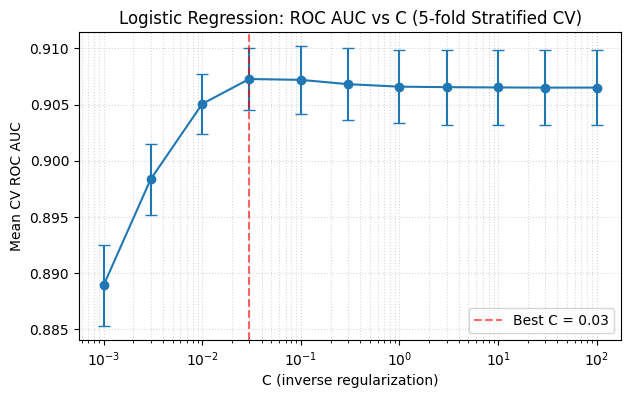

# Bank Marketing: Term Deposit Classifier

  

Predicts whether a client subscribes to a term deposit using the UCI Bank Marketing dataset. The project demonstrates clean preprocessing, baseline modelling, cross-validated tuning, and clear evaluation for imbalanced data.

- **Problem:** Binary classification of term-deposit subscription  
- **Data:** UCI Bank Marketing (`bank-full.csv`)  
- **Methods:** `ColumnTransformer` + `StandardScaler`, Logistic Regression (L2, L1, Elastic Net), Stratified k-fold CV  
- **Metrics:** Accuracy, ROC AUC, Precision, Recall, F1 Score, Confusion Matrix  
- **Why it matters:** In banking and fintech, optimising contact strategy reduces cost and customer fatigue. Calibrated probabilities and threshold selection support smarter outreach decisions.  

**Result:** Tuned logistic regression achieved ROC AUC ≈ **0.90**, balancing precision and recall under class imbalance.  



---

## Project structure
```
notebooks/
    analysis.ipynb        # narrative analysis and results
data/
    bank-full.csv         # dataset (tracked)
reports/
    figures/
        roc_curve.png     # ROC AUC plot (tracked)
src/                      # optional utilities if modularised
```

---

## Getting Started

1. **Clone and create environment**
   ```bash
   git clone <this-repo>
   cd <this-repo>
   python -m venv .venv
   source .venv/bin/activate   # or .venv\Scripts\activate on Windows
   pip install -r requirements.txt
   ```

2. **Data**
   - Download the [UCI Bank Marketing dataset](https://archive.ics.uci.edu/dataset/222/bank+marketing)  
   - Place `bank-full.csv` at `data/bank-full.csv` (already included here for convenience)

3. **Run the notebook**
   - Open `notebooks/analysis.ipynb`  
   - Run cells top-to-bottom to reproduce results  

---

## Reproducibility notes
- The notebook uses consistent preprocessing pipelines and stratified CV for fair evaluation under class imbalance.  
- Paths are relative (`data/bank-full.csv`, `reports/figures/`) so the project works when cloned without extra setup.  
- For extensions, you can add:
  - **Threshold tuning** for different business trade-offs  
  - **Cost-sensitive evaluation** if false positives/negatives have unequal impact  
  - **Probability calibration** for downstream decision systems  

---

## Tips for GitHub
- Only specific assets are tracked (e.g., `data/bank-full.csv`, `reports/figures/roc_curve.png`); other large/raw artifacts remain ignored.  
- For cleaner commits, consider `nbstripout` to strip cell outputs before pushing.  
- If storing large datasets, use Git LFS.  

---

## Example usage
```python
import pandas as pd

# Load dataset
df = pd.read_csv("data/bank-full.csv", sep=";")
print(df.shape)
```
---

## Next Steps

This project establishes a strong baseline and tuned models, but there are clear directions for extension:

- **Threshold tuning** — adjust decision thresholds to balance precision and recall for different business needs  
- **Cost-sensitive evaluation** — incorporate unequal costs of false positives vs false negatives into model selection  
- **Probability calibration** — improve probability estimates with Platt scaling or isotonic regression  
- **Model extensions** — explore tree-based ensembles (Random Forest, XGBoost) or non-linear classifiers (SVM) for further gains  
- **Deployment** — package the pipeline with `scikit-learn`'s `Pipeline` and export for API or batch inference  

These steps reflect real-world considerations in applied ML, especially in imbalanced domains like banking and fintech.
